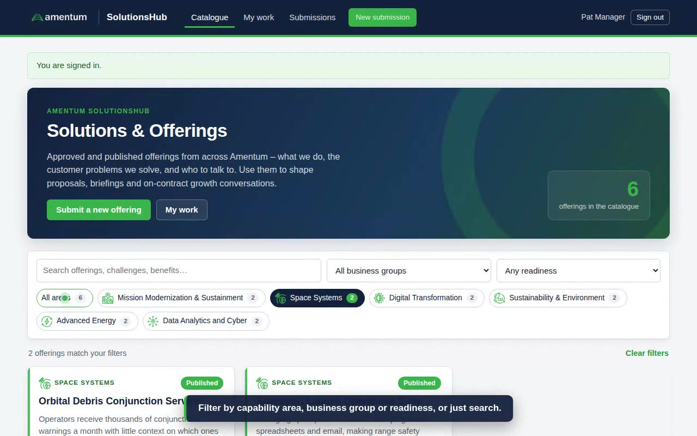

# SolutionsHub

SolutionsHub is the proposed intake, review, approval, and publishing-handoff system for new Amentum
Solutions / Offerings. It replaces the current Microsoft Form + manual follow-up with a single low-cost
Azure-hosted web application that works for users on two unconnected corporate domains.

This repository contains the Phase 0 scoping documents and the **Phase 1 deployable MVP**: the FastAPI
application, Alembic migrations, tests, Bicep infrastructure, and GitHub Actions workflows.

## Demo

[](docs/media/solutionshub-walkthrough.mp4)

**[Watch the 3-minute walkthrough](docs/media/solutionshub-walkthrough.mp4)** – sign-in, the catalogue landing page,
an offering page, the intake form, and the reviewer → approver → publisher route through to publication.
(GitHub plays the MP4 in the browser when you open the file.)

## Documents

| Document | What it covers |
|---|---|
| [01 – Solution Scope](docs/01-solution-scope.md) | Executive summary, constraints, target architecture, Azure service selection, cost estimate, requirements traceability, gaps, roadmap, open questions |
| [02 – Workflow & RBAC](docs/02-workflow-and-rbac.md) | Roles, permission matrix, workflow state machine, transitions, notifications, reminders, 6-month review, audit record |
| [03 – Data Model](docs/03-data-model.md) | Intake form field inventory, entities and relationships, capability taxonomy seed data, attachment storage, retention |
| [04 – Authentication & Access](docs/04-auth-and-access.md) | Public endpoint rationale, magic-link email sign-in, sessions, rate limiting, role administration, threat notes |
| [05 – Deployment & Operations](docs/05-deployment.md) | Local development, Azure setup, infra and app deployment, first sign-in, email deliverability, operations, troubleshooting |

## Headline design

- **Hosting:** Azure App Service (B1 Linux, built-in Python 3.12) running a FastAPI web app
- **Data:** Azure Database for PostgreSQL Flexible Server (B1ms) + Azure Blob Storage for attachments
- **Email:** Azure Communication Services Email for sign-in links and workflow notifications
- **Access:** public HTTPS endpoint; passwordless magic-link sign-in limited to `@amentum.com`,
  `@global.amentum.com` and `@amentumcms.com`; application-level RBAC for Reviewer / Approver / Publisher / Admin
- **Permissions needed to deploy:** Contributor on one resource group. No role assignments, no Key Vault;
  services authenticate with keys and connection strings written to App Service settings
- **Cost:** roughly **$30 USD per month** for a single production environment

## What users see

- **Catalogue** (home): a gallery of approved and published offerings, filterable by capability area (with
  Amentum's capability icons), business group, readiness and free-text search. Every signed-in user can open an
  offering's read-only page, download its supporting files and contact the owners.
- **My work**: the submitter's own records and, for reviewers/approvers/publishers, the queue of items waiting on them.
- **Submissions**: the working list and full workflow record (restricted to contacts and staff).

Run `python -m scripts.seed_demo` against a non-production database to populate sample offerings for a demo.

## Quick start (local)

```bash
pip install -r requirements-dev.txt
cp .env.example .env                 # set DATABASE_URL and BOOTSTRAP_ADMIN_EMAIL
docker compose up -d db              # or use an existing PostgreSQL 16
python -m alembic upgrade head && python -m app.seed
uvicorn app.main:app --reload        # http://localhost:8000
pytest -q
```

## Repository layout

| Path | Contents |
|---|---|
| `app/` | FastAPI application: `models.py`, `workflow.py`, `policy.py`, `auth.py`, routers, services, Jinja templates, static assets |
| `alembic/` | Database migrations |
| `tests/` | pytest suite (sign-in, CSRF, policy matrix, full lifecycle, reminders, admin) |
| `infra/` | Bicep template and parameters for all Azure resources (Contributor-only, no RBAC) |
| `.github/workflows/` | CI (lint, migrations, tests, Bicep build), app deploy (publish-profile zip deploy), optional infra deploy |
| `docs/` | Scoping and operations documentation |
| `startup.sh` | App Service startup: migrate, seed, run Gunicorn |

## Source inputs

The design was derived from two internal documents (not committed to this repository):

- *Solution / Offering Executive Summary – Business Offering Intake* (Microsoft Form, 17 fields)
- *New Solution / Offering Input Process – High-Level Requirements, Through Publishing* (v3)

Their content is captured in the field inventory (doc 03) and requirements traceability matrix (doc 01).
