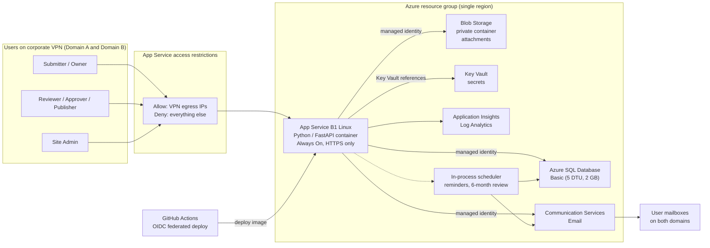

# 01 – Solution Scope

**System:** SolutionsHub – New Solution / Offering intake, review, approval, and publishing handoff
**Status:** Scoping (Phase 0)
**Audience:** Sponsor, Cyber/Security review, implementation team

---

## 1. Executive summary

Amentum needs one consistent, tracked process to take a new Solution / Offering from initial submission
through review, approval, and publication. Today the intake is a Microsoft Form; review, approval, and
follow-up are manual. The requirements document defines a seven-stage workflow, named roles, reminders,
an approval record, a publishing handoff, and a six-month content refresh cycle.

The proposed solution is a small, self-contained web application hosted on Azure:

- A **single Python web app** on Azure App Service (B1 Linux) that serves the intake form, the review /
  approval workflow, and an admin area.
- **Azure SQL Database (Basic)** as the single source of truth, **Azure Blob Storage** for attachments,
  and **Azure Communication Services Email** for sign-in links and notifications.
- **Edge access** limited to the corporate VPN egress IP addresses of both domains using App Service
  access restrictions.
- **Passwordless magic-link sign-in** for every user. This is the mechanism that satisfies the "anyone
  can submit, but we track their email" requirement, and it gives submitters a way back in to edit their
  own submissions without any account provisioning.
- **Application-level RBAC** (Reviewer, Approver, Publisher, Admin) stored in the app's own database and
  managed by an admin, because Entra ID / corporate SSO cannot be used across the two unconnected domains.

Estimated running cost is **about $19 USD per month** for production, roughly double with a separate
dev/test environment.

The solution meets requirements sections 1–6, 8, and 9 fully, and sections 7, 10, and 11 partially. The
main gaps are direct publishing to the destination system (delivered as a controlled handoff instead) and
measuring content usage outside the app. Details are in the traceability matrix (section 8).

---

## 2. Constraints and decisions

### 2.1 Hard constraints (from the sponsor)

| # | Constraint | Design consequence |
|---|---|---|
| C1 | Users come from **two unconnected domains**; Entra ID / corporate SSO is not available | No federated identity. Identity is proven by possession of a work mailbox (magic link). Roles live in the app. |
| C2 | Only network-level control available is the **internal VPN egress IP** | App Service access restrictions allowlist the VPN egress IP ranges of both domains; everything else is denied at the edge. |
| C3 | **RBAC** is required for workflow approvers | App-managed roles with an admin UI, enforced server-side on every action, with an audit trail. |
| C4 | Input side must be **simple; anyone can use it**, but capture the submitter's **email** for updates and to allow edits | Email-first sign-in with no registration step; the email becomes the submitter identity and notification target. |
| C5 | **Minimal cost** | Smallest always-on tiers; no premium networking; free-grant tiers for telemetry; single region; no redundancy beyond platform defaults. |
| C6 | Primarily **Azure services** | All components are Azure PaaS. GitHub is used for source control and CI/CD. |

### 2.2 Decisions taken during scoping

| Decision | Choice | Alternatives considered |
|---|---|---|
| Deliverable of this phase | Scoping documentation only | Docs + IaC skeleton; docs + MVP |
| Application stack | Python 3.12, FastAPI, Jinja2 templates, HTMX | .NET 8, Node.js |
| Hosting | App Service B1 Linux (always on) | Container Apps consumption (scale-to-zero, cold starts, needs registry) |
| User authentication | Magic-link email for all users | Local passwords; Entra External ID (CIAM) tenant |
| Database | Azure SQL Database Basic | Cosmos DB free tier; Azure SQL serverless; PostgreSQL Flexible Server |

---

## 3. Target architecture

### 3.1 Request flow in one paragraph

A user on either corporate VPN opens the site. App Service checks the source IP against the allowlist and
returns HTTP 403 to anything else. The user enters their work email; the app validates it against an
allowed-domain list, creates a single-use token, and sends a sign-in link via Communication Services
Email. Clicking the link establishes a signed session cookie. The app looks up the user's roles, renders
the pages they are entitled to, and writes every state change to an audit table in Azure SQL. Attachments
are streamed to a private Blob container. A background scheduler running inside the same App Service
instance sends reminders and six-month review notices.

---

## 4. Azure service selection

| Concern | Selected service and tier | Why | Rejected alternatives |
|---|---|---|---|
| Web hosting | **App Service Plan B1 Linux** + Web App for Containers, Always On | Fixed low cost, no cold starts, built-in IP access restrictions on both the app and the SCM/Kudu site, free managed TLS certificate, easy GitHub Actions deploy. | **Container Apps (consumption):** cheaper at zero traffic but cold starts on first hit, requires a container registry and Log Analytics; more moving parts for a low-traffic internal app. **App Service F1/D1:** no Always On, daily CPU quota, not suitable for scheduled jobs. |
| Relational data | **Azure SQL Database Basic** (5 DTU, 2 GB) | Workflow state, role assignments, comments, and an approval audit trail are naturally relational. Basic is the cheapest always-on SQL tier and has a straightforward upgrade path (S0, S1) with no code change. 7-day point-in-time restore included. | **Cosmos DB free tier:** $0 but document model is a poorer fit for joins, reporting, and audit queries. **Azure SQL serverless:** auto-pause saves money only when idle for long stretches; office-hours use costs more than Basic and resumes take up to a minute. **PostgreSQL Flexible B1ms:** ~$12–15/mo more; avoids the ODBC driver dependency (see section 5). |
| File attachments | **Storage account** (StorageV2, LRS, Hot), one private container | Pennies per month for the expected volume. Soft delete and blob versioning provide accidental-deletion protection. | Storing files in SQL (2 GB Basic cap makes this a non-starter). |
| Email | **Azure Communication Services Email** | Transactional email at fractions of a cent per message; SDK for Python; works with managed identity. Can start on an Azure-managed sender domain with zero DNS work. | SMTP relay through a corporate mail server (cross-domain relay permissions are unlikely); SendGrid (third-party approval overhead). |
| Secrets | **Key Vault Standard** with App Service Key Vault references | Keeps the session signing key and any connection strings out of app settings and source control. Cost is effectively zero at this volume. | Plain app settings (acceptable for dev only). |
| Identity for the app itself | **System-assigned managed identity** on the Web App | Removes passwords for SQL, Blob, Key Vault, and Communication Services. This is Azure identity for the *application*, not for users, so it does not conflict with constraint C1. | SQL authentication with a stored password. |
| Telemetry | **Application Insights** on a Log Analytics workspace with a daily cap | First 5 GB per month of ingestion is free; a low daily cap guarantees it stays there. | None needed. |
| Scheduled work | **In-process scheduler** (APScheduler) inside the web app, guarded by a database lock | No extra service or cost. B1 with Always On keeps the process alive. A DB lock prevents double-sending if the plan is ever scaled to two instances. | **Azure Functions consumption timer:** free grant covers it and is the right move if the app is later scaled out; **WebJobs**. |
| CI/CD | **GitHub Actions** with an OIDC federated credential to Azure | No long-lived deployment secrets. Builds the container image and deploys to App Service. | Azure DevOps pipelines (adds another system). |
| Container image registry | **GitHub Container Registry** (private, in the repo's org) | Free for the expected volume; App Service pulls with a scoped token. | **Azure Container Registry Basic** (~$5/mo) if the team prefers everything in Azure. |
| Infrastructure as code | **Bicep** (Phase 1) | Native Azure, no state file to manage. | Terraform. |

### 4.1 What is deliberately *not* used

- No Virtual Network, Private Endpoints, Front Door, Application Gateway, or WAF. These would add
  $30–$300+/month. IP access restrictions on App Service give the same effective edge control for an
  internal VPN-only audience. Revisit if the app is ever exposed outside the VPN.
- No deployment slots (B1 does not support them; S1 at ~$69/mo would be needed). Zero-downtime deploys are
  not a requirement for an internal intake tool.
- No geo-redundancy. Azure SQL Basic point-in-time restore and Blob soft delete cover the realistic
  failure modes for this workload.

---

## 5. Application stack

| Layer | Choice | Notes |
|---|---|---|
| Runtime | Python 3.12 | |
| Web framework | FastAPI + Uvicorn (behind Gunicorn) | Async, typed, small footprint. |
| Templating / UI | Jinja2 server-rendered pages + HTMX for partial updates | No SPA build pipeline. Accessible, works without heavy JavaScript. Simple form UX for submitters. |
| ORM / migrations | SQLAlchemy 2.x + Alembic | Schema is versioned and migrated on deploy. |
| SQL driver | `pyodbc` with Microsoft ODBC Driver 18, using managed identity | The App Service built-in Python image does **not** include the ODBC driver, so the app is shipped as a **custom container** (Dockerfile installs the driver). This is the main reason for the container deployment model. If the team prefers the built-in Python image, switch the database to PostgreSQL Flexible Server (adds ~$12–15/mo) and use `psycopg`. |
| Azure SDKs | `azure-identity`, `azure-storage-blob`, `azure-communication-email`, `azure-keyvault-secrets` | All support `DefaultAzureCredential` so local dev and App Service use the same code path. |
| Background jobs | APScheduler (in-process) | Jobs: overdue-action reminders, six-month review notices, token and session cleanup, notification retry. |
| Forms / validation | Pydantic models | Server-side validation of required fields, "select at most 3 capabilities", attachment count and size. |
| Testing | pytest, HTTPX test client, a local SQL Server container or SQLite for unit tests | |
| Observability | OpenTelemetry → Application Insights | Request traces, exceptions, custom events for workflow transitions. |

---

## 6. Monthly cost estimate

Prices are approximate pay-as-you-go list prices for a US region and should be confirmed in the Azure
Pricing Calculator before approval. Figures exclude tax and any enterprise discount.

| Service | Tier / assumption | Est. USD per month |
|---|---|---|
| App Service Plan | B1 Linux, 1 instance, 730 hours | ~13.00 |
| Azure SQL Database | Basic, 5 DTU, 2 GB | ~5.00 |
| Storage account | 10 GB Hot LRS + a few thousand operations | ~0.50 |
| Communication Services Email | ~500 messages/month | ~0.20 |
| Key Vault | Standard, a few thousand operations | ~0.05 |
| Application Insights / Log Analytics | Under the 5 GB free ingestion grant, daily cap set | 0.00 |
| GitHub Container Registry | Private image within org allowance | 0.00 |
| **Total (production)** | | **~$19** |
| Optional second environment (dev/test) | Same footprint | ~+19 |
| Optional: Azure Container Registry Basic instead of GHCR | | ~+5 |
| Optional: PostgreSQL Flexible B1ms instead of Azure SQL Basic | 32 GB storage | ~+12 to +15 |

Cost levers if the app grows:

- Azure SQL Basic → S0 (~$15) → S1 (~$30) when DTU or the 2 GB cap becomes a constraint.
- App Service B1 → B2 (~$26) for more memory, or S1 (~$69) if deployment slots are wanted.
- Blob storage grows linearly at roughly $0.02 per GB per month.

---

## 7. Access and security model (summary)

Full detail is in [04 – Authentication & Access](04-auth-and-access.md).

| Layer | Control |
|---|---|
| Network edge | App Service access restrictions: allow VPN egress IP ranges for both domains, deny all others, applied to the main site and the SCM site. HTTPS only, minimum TLS 1.2, FTP/FTPS disabled. |
| User identity | Passwordless magic link to a work email on an allowed domain. 15-minute single-use token. No accounts to provision or passwords to reset. |
| Session | Signed, HttpOnly, Secure, SameSite=Lax cookie; 8-hour sliding expiry, optional 30-day "remember me". |
| Authorization | Roles (Submitter implicit, Reviewer, Approver, Publisher, Admin) held in the database; optional scoping of Reviewer/Approver to a business group. Every mutating request is checked server-side against role and record ownership. |
| Application identity | System-assigned managed identity for SQL, Blob, Key Vault, and Email. No connection strings with passwords. |
| Data protection | Encryption at rest (platform default) for SQL and Blob; private Blob container, no anonymous access; attachments served only through the app or with short-lived SAS. |
| Audit | Every workflow transition, approval decision, role change, and sign-in is written to an append-only audit table. |
| Abuse controls | Rate limits on sign-in requests per email and per IP, CSRF tokens on forms, attachment type and size limits, dependency scanning in CI. |
| Backup | Azure SQL Basic 7-day point-in-time restore; Blob soft delete (30 days) and versioning. |

---

## 8. Requirements traceability matrix

Requirement sections refer to *New Solution / Offering Input Process – High-Level Requirements v3*.

| § | Requirement | How the design meets it | Status |
|---|---|---|---|
| 1 | New Solution / Offering intake: standard submission, required vs optional fields, submitting org and owner, co-leaders / backups, supporting documents | Web intake form reproducing all 17 form fields with server-side required-field validation; `submission_contacts` records recorder, owner(s), co-leads, and solution architect; up to 10 attachments plus links/notes. Submitter is any authenticated (magic-link) user on VPN. | **Met** |
| 2 | Centralized information: single source of truth, updates over time, defined edit access, site-level admin | One record per submission in Azure SQL; versioned snapshots at each approval; owners/co-leads can edit their record in editable states; Admin role can edit, reopen, or archive any record. | **Met** |
| 3 | Review & validation: route to stakeholders, request changes, flag missing info, automated reminders, track status and next actor | Reviewer role claims a submission; "Request updates" returns it to the submitter with comments; completeness check lists missing required fields; scheduler emails the responsible party every 5 business days while an action is outstanding; each record shows status and "waiting on". | **Met** |
| 4 | Collaboration & updates: submitter, owner, and stakeholders work together; visibility of outstanding actions; clear readiness for next stage | Threaded comments on each submission with email notification; outstanding-action panel; explicit "Submit for approval" and "Resubmit" actions with guards. | **Met** |
| 5 | Approval: required approvers, approve / reject / request changes, record of approval, block unapproved content | Approver role (optionally scoped per business group); decisions stored in `workflow_events` with actor, timestamp, and note; approved snapshot saved to `submission_versions`; publishing actions are only available from Approved. | **Met** |
| 6 | Publishing readiness: complete, approved, correct format, version and destination identified | "Ready to Publish" checklist requires all required fields, an approval event on the current version, a selected destination, and generates the export package. | **Met** |
| 7 | Publishing / handoff: direct publish where feasible, else controlled handoff; visibility of publication | **Handoff only** in scope: Publisher downloads an export package (Markdown/JSON + attachments) and records destination URL and date; owners are notified; status becomes Published. Direct publishing depends on the destination platform, which is not yet identified. | **Partial** |
| 8 | Status & tracking: the seven stages, current status, outstanding requirements, next owner | State machine implements exactly the seven stages plus Withdrawn/Rejected; dashboard lists submissions by status with "waiting on" and age. | **Met** |
| 9 | Access & domain considerations: who can submit/review/approve/publish, can users reach it, can information move between domains, system limits | Access requires only VPN reachability and a mailbox on an allowed domain, so both domains are supported without identity federation. Information lives in one neutral Azure location reachable from both. Known limit: email deliverability into both domains requires a verified sender domain with SPF/DKIM (Phase 1 task). | **Met** (with the email deliverability caveat) |
| 10 | Security & existing capabilities: evaluate internal capabilities first; document gaps; account for Cyber, security, integration, and approval processes for external solutions | The natural internal capability (Microsoft Forms + Power Automate + SharePoint/Lists) works only inside a single M365 tenant; the two-domain constraint is the documented gap. This custom Azure app will need Cyber review; section 7 of this document and doc 04 list the controls to support that review. Additional review time must be planned. | **Partial** (requires Cyber approval process) |
| 11 | Post-publishing maintenance & adoption: six-month review reminders, track currency, usage metrics, contributor visibility, PM usage of materials | Scheduler sends a review notice at publish + 6 months and tracks confirmation/overdue; in-app page views and attachment downloads are recorded per submission; a contributor view derived from audit data is planned for Phase 2. Usage of materials by Program Managers *outside* the app cannot be measured by this system. | **Partial** |
| 12 | Success criteria | One intake process, one source of truth, ownership per stage, defined review/approval, status visibility, reduced manual follow-up, controlled path to publishing, access controls, works within domain constraints, uses existing capabilities where feasible. | **Met**, except "uses existing capabilities" where the gap is documented above. |

---

## 9. Gaps, assumptions, and risks

### 9.1 Gaps against requirements

1. **Direct publishing (§7).** Delivered as a controlled handoff. Direct integration is Phase 3 once the
   destination (external website CMS, SharePoint, other) is known.
2. **Off-platform usage metrics (§11).** Only in-app views and downloads are measurable.
3. **Existing-capability path (§10).** Not viable across two unconnected domains; this is the justification
   for a custom build and should be recorded formally for the Cyber review.

### 9.2 Gap in the intake form itself

The current Microsoft Form has **no "Solution / Offering Name" field**. Every downstream stage (lists,
emails, export package, published page) needs a title. The design adds a required **Offering Name** field
and recommends the form owner adopt it.

### 9.3 Assumptions

- Both corporate VPNs egress to the internet through a stable, known set of public IP addresses that can
  be provided to the implementation team.
- Users on both domains can receive external email from an Azure Communication Services sender domain
  once SPF/DKIM are configured.
- Expected volume is low: tens of submissions per month, hundreds of emails per month, well under 2 GB of
  relational data and tens of GB of attachments in year one.
- A GitHub organization is available for source control, CI/CD, and the container registry.
- The business group list and the second domain name will be supplied before Phase 1 build.

### 9.4 Risks

| Risk | Impact | Mitigation |
|---|---|---|
| Sign-in and notification emails land in spam on one or both domains | Users cannot sign in; workflow stalls | Verify a custom sender domain in Communication Services with SPF, DKIM, and DMARC before go-live; ask mail admins on both domains to allowlist the sender. Provide an admin "resend" action. |
| VPN egress IPs change or a user is off-VPN | Legitimate users get 403 | Document the IP list as configuration in IaC; show a clear "connect to VPN" 403 page; make IP list changes a low-friction operational task. |
| Single App Service instance restarts mid-job | Missed reminder run | Jobs are idempotent and re-run on the next schedule; a DB lock prevents duplicates. |
| Azure SQL Basic 2 GB cap | Writes fail when full | Attachments are in Blob, not SQL; alerts at 70% and 85%; upgrade to S0 is a portal setting. |
| Cyber review time for a custom app | Schedule slip | Start the review in parallel with Phase 1 using this document and doc 04 as the input. |
| ODBC driver dependency in the container image | Build complexity | Pin the driver version in the Dockerfile; or switch to PostgreSQL at a known cost delta. |

---

## 10. Phased roadmap

| Phase | Scope | Indicative effort |
|---|---|---|
| **0 – Scoping (this document)** | Architecture, cost, RBAC model, workflow, data model, security posture, gaps | Complete |
| **1 – MVP** | Bicep IaC for all resources; GitHub Actions CI/CD; intake form (all fields + Offering Name); magic-link sign-in; roles and admin UI; full seven-stage workflow with comments, reminders, and audit; export package for publishing handoff; Application Insights; Cyber review in parallel | ~4–6 weeks for one developer |
| **2 – Maintain & measure** | Six-month review cycle with overdue tracking; per-submission page view and download metrics; contributor / owner activity view (recognition); custom email sender domain; business-group-scoped approvers if needed; dev/test environment | ~2–3 weeks |
| **3 – Publish integration** | Direct publishing to the destination platform once identified; publication confirmation back into the record | Depends on destination |

---

## 11. Open questions for the business

1. What is the definitive **list of Business Groups** for the dropdown?
2. What is the **second domain** name, and what are the **VPN egress IP ranges** for both domains?
3. What is the **publishing destination** (external website CMS, SharePoint, other) and who owns it?
4. Should approvers be **scoped by Business Group**, or is there one global approver pool?
5. Who are the **initial Site Admins**?
6. What **attachment limits** apply (per-file size, total per submission, allowed file types)?
7. Is a **Draft** state (saved but not yet submitted) needed, or is Submitted the first state?
8. What is the **retention policy** for withdrawn/rejected submissions and their attachments?
9. Can the form owner add a required **Offering Name** field?
10. Does either domain's mail gateway need to **allowlist** the Communication Services sender domain?
