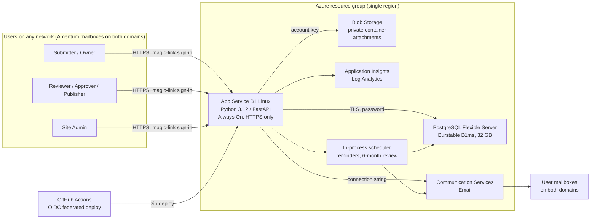

# 01 – Solution Scope

**System:** SolutionsHub – New Solution / Offering intake, review, approval, and publishing handoff
**Status:** Scoping (Phase 0)
**Audience:** Sponsor, Cyber/Security review, implementation team

---

## 1. Executive summary

Amentum needs one consistent, tracked process to take a new Solution / Offering from initial submission
through review, approval, and publication. Today the intake is a Microsoft Form; review, approval, and
follow-up are manual. The requirements document defines a seven-stage workflow, named roles, reminders,
an approval record, a publishing handoff, and a six-month content refresh cycle.

The proposed solution is a small, self-contained web application hosted on Azure:

- A **single Python web app** (FastAPI) on Azure App Service (B1 Linux, built-in Python 3.12 image) that serves the
  intake form, the review / approval workflow, and an admin area.
- **Azure Database for PostgreSQL (Flexible Server, B1ms)** as the single source of truth, **Azure Blob Storage** for attachments,
  and **Azure Communication Services Email** for sign-in links and notifications.
- A **public HTTPS endpoint** with no network allowlist. The sponsor accepted this: the only anonymous surface is the
  sign-in page, and sign-in is possible only with a mailbox on an allowed Amentum domain.
- **Passwordless magic-link sign-in** for every user. This is the mechanism that satisfies the "anyone
  can submit, but we track their email" requirement, and it gives submitters a way back in to edit their
  own submissions without any account provisioning.
- **Application-level RBAC** (Reviewer, Approver, Publisher, Admin) stored in the app's own database and
  managed by an admin, because Entra ID / corporate SSO cannot be used across the two unconnected domains.

Estimated running cost is **about $30 USD per month** for production, roughly double with a separate
dev/test environment.

The solution meets requirements sections 1–6, 8, and 9 fully, and sections 7, 10, and 11 partially. The
main gaps are direct publishing to the destination system (delivered as a controlled handoff instead) and
measuring content usage outside the app. Details are in the traceability matrix (section 8).

---

## 2. Constraints and decisions

### 2.1 Hard constraints (from the sponsor)

| # | Constraint | Design consequence |
|---|---|---|
| C1 | Users come from **two unconnected domains**; Entra ID / corporate SSO is not available | No federated identity. Identity is proven by possession of a work mailbox (magic link). Roles live in the app. |
| C2 | ~~Only network-level control available is the VPN egress IP~~ **Revised:** the sponsor is happy for anyone to reach the endpoint as long as only Amentum mailboxes can sign in | No IP allowlist. Identity (magic link to an allowed domain) is the gate; rate limiting and uniform responses protect the public sign-in page. |
| C3 | **RBAC** is required for workflow approvers | App-managed roles with an admin UI, enforced server-side on every action, with an audit trail. |
| C4 | Input side must be **simple; anyone can use it**, but capture the submitter's **email** for updates and to allow edits | Email-first sign-in with no registration step; the email becomes the submitter identity and notification target. |
| C5 | **Minimal cost** | Smallest always-on tiers; no premium networking; free-grant tiers for telemetry; single region; no redundancy beyond platform defaults. |
| C6 | Primarily **Azure services** | All components are Azure PaaS. GitHub is used for source control and CI/CD. |
| C7 | The team has **Contributor** on the resource group only, so it cannot create role assignments | No managed-identity RBAC anywhere. Services authenticate with keys and connection strings held in App Service settings; no Key Vault (its RBAC or access-policy model would add a dependency the team cannot always satisfy). |

### 2.2 Decisions taken during scoping

| Decision | Choice | Alternatives considered |
|---|---|---|
| Deliverable | Phase 0 scoping docs, then a **Phase 1 deployable MVP** (application, Bicep IaC, CI/CD) – both delivered in this repository | – |
| Application stack | Python 3.12, FastAPI, Jinja2 templates, HTMX | .NET 8, Node.js |
| Hosting | App Service B1 Linux (always on), public endpoint | Container Apps consumption (scale-to-zero, cold starts, needs registry) |
| Service-to-service auth | Keys / connection strings in App Service settings (Contributor-only constraint) | Managed identity + RBAC; Key Vault references |
| User authentication | Magic-link email for all users; allowed domains `amentum.com`, `global.amentum.com`, `amentumcms.com` | Local passwords; Entra External ID (CIAM) tenant |
| Database | Azure Database for PostgreSQL Flexible Server (Burstable B1ms) – sponsor accepted the ~$11/mo premium over Azure SQL Basic to avoid the ODBC/container dependency | Azure SQL Basic; Cosmos DB free tier; Azure SQL serverless |

---

## 3. Target architecture

### 3.1 Request flow in one paragraph

A user opens the site from any network. Every page except sign-in redirects to the sign-in form. The user enters their work email; the app validates it against an
allowed-domain list, creates a single-use token, and sends a sign-in link via Communication Services
Email. Clicking the link establishes a signed session cookie. The app looks up the user's roles, renders
the pages they are entitled to, and writes every state change to an audit table in PostgreSQL. Attachments
are streamed to a private Blob container. A background scheduler running inside the same App Service
instance sends reminders and six-month review notices.

---

## 4. Azure service selection

| Concern | Selected service and tier | Why | Rejected alternatives |
|---|---|---|---|
| Web hosting | **App Service Plan B1 Linux** + Web App on the built-in Python 3.12 image, Always On, public endpoint | Fixed low cost, no cold starts, free managed TLS certificate, publish-profile deploy from GitHub Actions. | **Container Apps (consumption):** cheaper at zero traffic but cold starts on first hit, requires a container registry and Log Analytics; more moving parts for a low-traffic internal app. **App Service F1/D1:** no Always On, daily CPU quota, not suitable for scheduled jobs. |
| Relational data | **Azure Database for PostgreSQL Flexible Server**, Burstable B1ms (1 vCore, 2 GiB), 32 GB storage, 7-day backups | Workflow state, role assignments, comments and the audit trail are naturally relational. PostgreSQL works with the pip-installable `psycopg` driver on the stock App Service Python image, so no custom container or ODBC driver is needed. Advisory locks make the in-process scheduler safe to scale out. Vertical scaling is a portal setting. | **Azure SQL Basic:** ~$11/mo cheaper but needs the Microsoft ODBC driver, which forces a custom container image. **Cosmos DB free tier:** document model is a poorer fit for joins, reporting and audit. **Azure SQL serverless:** auto-pause resumes take up to a minute. |
| File attachments | **Storage account** (StorageV2, LRS, Hot), one private container | Pennies per month for the expected volume. Soft delete and blob versioning provide accidental-deletion protection. | Storing files in the database (bloats backups, slows queries). |
| Email | **Azure Communication Services Email** | Transactional email at fractions of a cent per message; SDK for Python; connection-string auth. Can start on an Azure-managed sender domain with zero DNS work. | SMTP relay through a corporate mail server (cross-domain relay permissions are unlikely); SendGrid (third-party approval overhead). |
| Secrets | **App Service application settings** (encrypted at rest) | The team cannot create role assignments, which Key Vault's RBAC model needs. Settings are only visible to people with write access to the web app. Key Vault is the documented upgrade path. | Key Vault with RBAC (blocked by permissions). |
| Service-to-service authentication | **Keys and connection strings**: PostgreSQL password, storage account key, Communication Services connection string | Deployable with Contributor on the resource group; no `Microsoft.Authorization` writes. All values are generated or read by the Bicep template and written straight into app settings. | Managed identity + RBAC (blocked by permissions). |
| Telemetry | **Application Insights** on a Log Analytics workspace with a daily cap | First 5 GB per month of ingestion is free; a low daily cap guarantees it stays there. | None needed. |
| Scheduled work | **In-process scheduler** (APScheduler) inside the web app, guarded by a database lock | No extra service or cost. B1 with Always On keeps the process alive. A DB lock prevents double-sending if the plan is ever scaled to two instances. | **Azure Functions consumption timer:** free grant covers it and is the right move if the app is later scaled out; **WebJobs**. |
| CI/CD | **GitHub Actions** with an OIDC federated credential to Azure | No long-lived deployment secrets. Runs lint/tests on every push, zip-deploys to App Service on `main`, and applies Bicep on demand. | Azure DevOps pipelines (adds another system). |
| Infrastructure as code | **Bicep** (`infra/main.bicep`, delivered) | Native Azure, no state file to manage. | Terraform. |

### 4.1 What is deliberately *not* used

- No Virtual Network, Private Endpoints, Front Door, Application Gateway, or WAF. These would add
  $30–$300+/month. The endpoint is public by decision; the sign-in page is the only anonymous surface and is
  rate limited. Add Front Door + WAF later if abuse is observed.
- No Key Vault and no managed-identity RBAC (team permissions). Secrets live in App Service settings.
- No deployment slots (B1 does not support them; S1 at ~$69/mo would be needed). Zero-downtime deploys are
  not a requirement for an internal intake tool.
- No geo-redundancy. PostgreSQL point-in-time restore and Blob soft delete cover the realistic
  failure modes for this workload.

---

## 5. Application stack

| Layer | Choice | Notes |
|---|---|---|
| Runtime | Python 3.12 | |
| Web framework | FastAPI + Uvicorn (behind Gunicorn) | Async, typed, small footprint. |
| Templating / UI | Jinja2 server-rendered pages + HTMX for partial updates | No SPA build pipeline. Accessible, works without heavy JavaScript. Simple form UX for submitters. |
| ORM / migrations | SQLAlchemy 2.x + Alembic | Schema is versioned and migrated on deploy. |
| Database driver | `psycopg` 3 (binary wheel) | Pure pip install; works on the stock App Service Python image with zip deploy. Connection string with `sslmode=require` is an App Service setting built by the template. |
| Azure SDKs | `azure-storage-blob`, `azure-communication-email` | Both are constructed from connection strings. `azure-identity` remains available for a later managed-identity switch. |
| Background jobs | APScheduler (in-process, PostgreSQL advisory lock) | Jobs: notification delivery every minute, overdue-action reminders hourly, six-month review notices hourly, housekeeping nightly. |
| Forms / validation | Pydantic models | Server-side validation of required fields, "select at most 3 capabilities", attachment count and size. |
| Testing | pytest + Starlette TestClient; runs against PostgreSQL in CI (SQLite fallback locally) | 27 tests cover sign-in, CSRF, policy matrix, the full lifecycle, reminders and admin. |
| Observability | OpenTelemetry → Application Insights | Request traces, exceptions, custom events for workflow transitions. |

---

## 6. Monthly cost estimate

Prices are approximate pay-as-you-go list prices for a US region and should be confirmed in the Azure
Pricing Calculator before approval. Figures exclude tax and any enterprise discount.

| Service | Tier / assumption | Est. USD per month |
|---|---|---|
| App Service Plan | B1 Linux, 1 instance, 730 hours | ~13.00 |
| Azure Database for PostgreSQL | Flexible Server, Burstable B1ms, 730 hours | ~12.50 |
| PostgreSQL storage + backup | 32 GB storage; 7-day backup within the free allowance | ~3.70 |
| Storage account | 10 GB Hot LRS + a few thousand operations | ~0.50 |
| Communication Services Email | ~500 messages/month | ~0.20 |
| Application Insights / Log Analytics | Under the 5 GB free ingestion grant, daily cap set | 0.00 |
| **Total (production)** | | **~$30** |
| Optional second environment (dev/test) | Same footprint | ~+30 |
| Alternative: Azure SQL Basic instead of PostgreSQL | Requires a custom container image | ~−11 |

Cost levers if the app grows:

- PostgreSQL B1ms → B2s (~$25) or General Purpose D2ds_v4 (~$125) if CPU credits or memory become a constraint.
- App Service B1 → B2 (~$26) for more memory, or S1 (~$69) if deployment slots are wanted.
- Blob storage grows linearly at roughly $0.02 per GB per month.

---

## 7. Access and security model (summary)

Full detail is in [04 – Authentication & Access](04-auth-and-access.md).

| Layer | Control |
|---|---|
| Network edge | Public HTTPS endpoint (decision, see C2). HTTPS only, minimum TLS 1.2, FTP/FTPS disabled, HSTS, strict CSP. Every route except sign-in, verify, health and static assets requires a session. |
| User identity | Passwordless magic link to a work email on an allowed domain. 15-minute single-use token. No accounts to provision or passwords to reset. |
| Session | Signed, HttpOnly, Secure, SameSite=Lax cookie; 8-hour sliding expiry, optional 30-day "remember me". |
| Authorization | Roles (Submitter implicit, Reviewer, Approver, Publisher, Admin) held in the database; optional scoping of Reviewer/Approver to a business group. Every mutating request is checked server-side against role and record ownership. |
| Service credentials | PostgreSQL password, storage account key and Communication Services connection string are generated/read by Bicep and stored as App Service settings (encrypted at rest, visible only to web-app writers). Rotate by re-running the template or updating the setting. |
| Data protection | Encryption at rest (platform default) for PostgreSQL and Blob; TLS enforced to the database; private Blob container, no anonymous access; attachments served only through the app or with short-lived SAS. |
| Audit | Every workflow transition, approval decision, role change, and sign-in is written to an append-only audit table. |
| Abuse controls | Rate limits on sign-in requests per email and per IP and on verify attempts, identical response for allowed and disallowed addresses, CSRF tokens on forms, attachment type and size limits, dependency scanning in CI. |
| Backup | PostgreSQL Flexible Server 7-day point-in-time restore; Blob soft delete (30 days) and versioning. |

---

## 8. Requirements traceability matrix

Requirement sections refer to *New Solution / Offering Input Process – High-Level Requirements v3*.

| § | Requirement | How the design meets it | Status |
|---|---|---|---|
| 1 | New Solution / Offering intake: standard submission, required vs optional fields, submitting org and owner, co-leaders / backups, supporting documents | Web intake form reproducing all 17 form fields with server-side required-field validation; `submission_contacts` records recorder, owner(s), co-leads, and solution architect; up to 10 attachments plus links/notes. Submitter is any authenticated (magic-link) user on an allowed domain. | **Met** |
| 2 | Centralized information: single source of truth, updates over time, defined edit access, site-level admin | One record per submission in PostgreSQL; versioned snapshots at each approval; owners/co-leads can edit their record in editable states; Admin role can edit, reopen, or archive any record. | **Met** |
| 3 | Review & validation: route to stakeholders, request changes, flag missing info, automated reminders, track status and next actor | Reviewer role claims a submission; "Request updates" returns it to the submitter with comments; completeness check lists missing required fields; scheduler emails the responsible party every 5 business days while an action is outstanding; each record shows status and "waiting on". | **Met** |
| 4 | Collaboration & updates: submitter, owner, and stakeholders work together; visibility of outstanding actions; clear readiness for next stage | Threaded comments on each submission with email notification; outstanding-action panel; explicit "Submit for approval" and "Resubmit" actions with guards. | **Met** |
| 5 | Approval: required approvers, approve / reject / request changes, record of approval, block unapproved content | Approver role (optionally scoped per business group); decisions stored in `workflow_events` with actor, timestamp, and note; approved snapshot saved to `submission_versions`; publishing actions are only available from Approved. | **Met** |
| 6 | Publishing readiness: complete, approved, correct format, version and destination identified | "Ready to Publish" checklist requires all required fields, an approval event on the current version, a selected destination, and generates the export package. | **Met** |
| 7 | Publishing / handoff: direct publish where feasible, else controlled handoff; visibility of publication | **Handoff only** in scope: Publisher downloads an export package (Markdown/JSON + attachments) and records destination URL and date; owners are notified; status becomes Published. Direct publishing depends on the destination platform, which is not yet identified. | **Partial** |
| 8 | Status & tracking: the seven stages, current status, outstanding requirements, next owner | State machine implements exactly the seven stages plus Withdrawn/Rejected; dashboard lists submissions by status with "waiting on" and age. | **Met** |
| 9 | Access & domain considerations: who can submit/review/approve/publish, can users reach it, can information move between domains, system limits | Access requires only a browser and a mailbox on an allowed domain, so both domains are supported without identity federation or network connectivity between them. Information lives in one neutral Azure location reachable from both. Known limit: email deliverability into both domains requires a verified sender domain with SPF/DKIM (Phase 1 task). | **Met** (with the email deliverability caveat) |
| 10 | Security & existing capabilities: evaluate internal capabilities first; document gaps; account for Cyber, security, integration, and approval processes for external solutions | The natural internal capability (Microsoft Forms + Power Automate + SharePoint/Lists) works only inside a single M365 tenant; the two-domain constraint is the documented gap. This custom Azure app will need Cyber review; section 7 of this document and doc 04 list the controls to support that review. Additional review time must be planned. | **Partial** (requires Cyber approval process) |
| 11 | Post-publishing maintenance & adoption: six-month review reminders, track currency, usage metrics, contributor visibility, PM usage of materials | Scheduler sends a review notice at publish + 6 months and tracks confirmation/overdue; in-app page views and attachment downloads are recorded per submission; a contributor view derived from audit data is planned for Phase 2. Usage of materials by Program Managers *outside* the app cannot be measured by this system. | **Partial** |
| 12 | Success criteria | One intake process, one source of truth, ownership per stage, defined review/approval, status visibility, reduced manual follow-up, controlled path to publishing, access controls, works within domain constraints, uses existing capabilities where feasible. | **Met**, except "uses existing capabilities" where the gap is documented above. |

---

## 9. Gaps, assumptions, and risks

### 9.1 Gaps against requirements

1. **Direct publishing (§7).** Delivered as a controlled handoff. Direct integration is Phase 3 once the
   destination (external website CMS, SharePoint, other) is known.
2. **Off-platform usage metrics (§11).** Only in-app views and downloads are measurable.
3. **Existing-capability path (§10).** Not viable across two unconnected domains; this is the justification
   for a custom build and should be recorded formally for the Cyber review.

### 9.2 Gap in the intake form itself

The current Microsoft Form has **no "Solution / Offering Name" field**. Every downstream stage (lists,
emails, export package, published page) needs a title. The design adds a required **Offering Name** field
and recommends the form owner adopt it.

### 9.3 Assumptions

- Users on both domains can reach a public `*.azurewebsites.net` HTTPS endpoint from their corporate networks
  (no proxy block on Azure App Service hostnames).
- Users on both domains can receive external email from an Azure Communication Services sender domain
  once SPF/DKIM are configured.
- Expected volume is low: tens of submissions per month, hundreds of emails per month, well under 2 GB of
  relational data and tens of GB of attachments in year one.
- A GitHub organization is available for source control, CI/CD, and the container registry.
- The business group list and the second domain name will be supplied before Phase 1 build.

### 9.4 Risks

| Risk | Impact | Mitigation |
|---|---|---|
| Sign-in and notification emails land in spam on one or both domains | Users cannot sign in; workflow stalls | Verify a custom sender domain in Communication Services with SPF, DKIM, and DMARC before go-live; ask mail admins on both domains to allowlist the sender. Provide an admin "resend" action. |
| Public sign-in page is probed or spammed from the internet | Nuisance email to Amentum addresses; load | Per-email and per-IP hourly rate limits, single-use tokens, uniform responses; monitor 429s in Application Insights; add Front Door/WAF if needed. |
| Secrets in App Service settings readable by anyone with write access to the web app | Credential exposure within the team | Keep the resource group's Contributor list short; rotate keys when membership changes; move to Key Vault + managed identity when permissions allow. |
| Single App Service instance restarts mid-job | Missed reminder run | Jobs are idempotent and re-run on the next schedule; a DB lock prevents duplicates. |
| PostgreSQL B1ms burstable CPU credits exhausted under sustained load | Slow responses | Expected load is light and bursty; monitor CPU credit metrics; scale to B2s is a portal setting. |
| Cyber review time for a custom app | Schedule slip | Start the review in parallel with Phase 1 using this document and doc 04 as the input. |
| PostgreSQL firewall allows all Azure services (MVP default) | Broader network exposure than necessary | Strong generated password, TLS required; harden by restricting to the web app's outbound IPs or VNet integration. |

---

## 10. Phased roadmap

| Phase | Scope | Indicative effort |
|---|---|---|
| **0 – Scoping** | Architecture, cost, RBAC model, workflow, data model, security posture, gaps | Complete |
| **1 – MVP** | Bicep IaC for all resources; GitHub Actions CI/CD; intake form (all fields + Offering Name); magic-link sign-in; roles and admin UI; full seven-stage workflow with comments, reminders, and audit; export package for publishing handoff; six-month review cycle; Application Insights | **Delivered** in this repository (see `docs/05-deployment.md`). Cyber review and go-live configuration remain. |
| **2 – Harden & measure** | Custom email sender domain (SPF/DKIM); Key Vault + managed identity once the team can create role assignments; PostgreSQL network hardening; contributor / owner activity view (recognition); metrics dashboard from the page-view data already collected; dev/test environment | ~2–3 weeks |
| **3 – Publish integration** | Direct publishing to the destination platform once identified; publication confirmation back into the record | Depends on destination |

---

## 11. Open questions for the business

1. What is the definitive **list of Business Groups** for the dropdown?
2. ~~Second domain name and VPN IP ranges~~ (answered: domains are `amentum.com`, `global.amentum.com`, `amentumcms.com`; no IP allowlist is used).
3. What is the **publishing destination** (external website CMS, SharePoint, other) and who owns it?
4. Should approvers be **scoped by Business Group**, or is there one global approver pool?
5. Who are the **initial Site Admins**?
6. What **attachment limits** apply (per-file size, total per submission, allowed file types)?
7. Is a **Draft** state (saved but not yet submitted) needed, or is Submitted the first state?
8. What is the **retention policy** for withdrawn/rejected submissions and their attachments?
9. Can the form owner add a required **Offering Name** field?
10. Does either domain's mail gateway need to **allowlist** the Communication Services sender domain?
