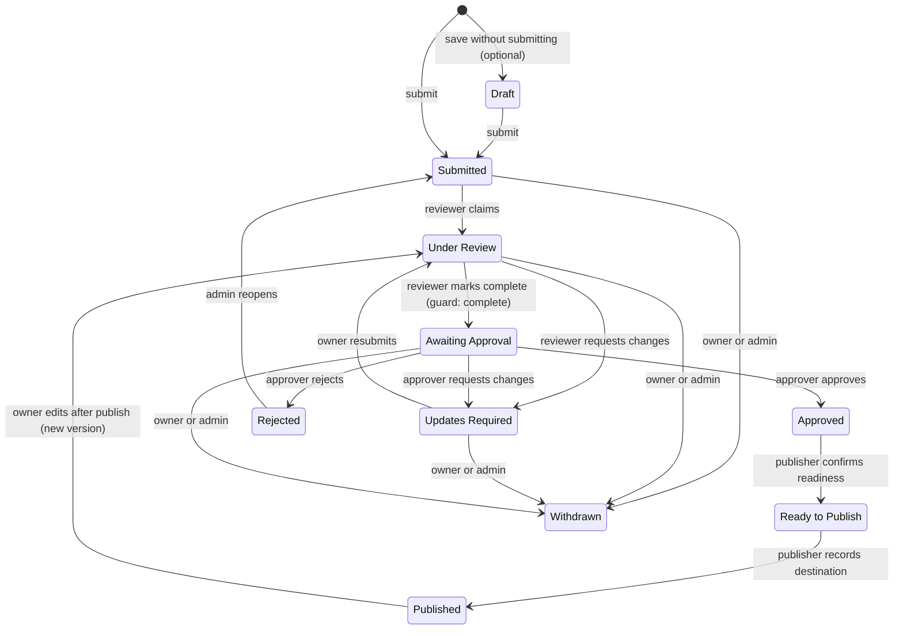

# 02 – Workflow and RBAC

This document defines the roles, permissions, workflow state machine, transitions, notifications, and
audit behaviour for SolutionsHub. It implements requirements sections 3, 4, 5, 6, 7, 8, and 11 of the
High-Level Requirements (v3).

---

## 1. Roles

Every user signs in the same way (magic link to a work email on an allowed domain). Roles are assigned to
an email address by a Site Admin and stored in the application database. A user may hold several roles.

| Role | Who | How granted |
|---|---|---|
| **Submitter** | Anyone who signs in | Implicit. No assignment needed. |
| **Owner / Co-lead** | People named on a specific submission as Offering Owner, Co-lead, or Solution Architect | Per submission, by the submitter or an Admin. Grants edit rights to that one record. |
| **Reviewer** | Stakeholders who validate content and request changes | Assigned by Admin. Optionally scoped to one or more Business Groups. |
| **Approver** | People with authority to approve content for publishing | Assigned by Admin. Optionally scoped to one or more Business Groups. |
| **Publisher** | The publishing team / person who moves approved content to its destination | Assigned by Admin. |
| **Admin** | Site-level administrators who maintain roles, reference data, and clean up stale content | Assigned by Admin. The first Admin is bootstrapped from an app setting. |

Design notes:

- Role checks are always evaluated **server-side** on each request. The UI hides actions the user cannot
  perform, but that is a convenience, not a control.
- Business-group scoping is optional. If the business confirms a single global reviewer/approver pool,
  the scope column is simply left null.
- A person may be both a Submitter and an Approver, but the system **prevents a user from approving a
  submission on which they are the recorder, owner, or co-lead**.

---

## 2. Permission matrix

Legend: **Y** allowed, **Own** allowed on submissions where the user is recorder/owner/co-lead,
**Scope** allowed within the user's business-group scope (or all, if unscoped), **–** not allowed.

| Action | Submitter | Owner / Co-lead | Reviewer | Approver | Publisher | Admin |
|---|---|---|---|---|---|---|
| Create a submission | Y | Y | Y | Y | Y | Y |
| View own submissions | Y | Y | Y | Y | Y | Y |
| View all submissions (list and detail) | – | – | Scope | Scope | Y | Y |
| Edit fields while in *Submitted* or *Updates Required* | Own | Own | – | – | – | Y |
| Add / remove attachments while editable | Own | Own | – | – | – | Y |
| Add / change owners and co-leads | Own | Own | – | – | – | Y |
| Withdraw a submission (non-terminal states) | Own | Own | – | – | – | Y |
| Comment on a submission | Own | Own | Scope | Scope | Y | Y |
| Claim for review (*Submitted* → *Under Review*) | – | – | Scope | – | – | Y |
| Request updates (→ *Updates Required*) | – | – | Scope | Scope | – | Y |
| Resubmit (*Updates Required* → *Under Review*) | Own | Own | – | – | – | Y |
| Mark review complete (→ *Awaiting Approval*) | – | – | Scope | – | – | Y |
| Approve / Reject (*Awaiting Approval*) | – | – | – | Scope (not own) | – | Y (not own) |
| Confirm publishing readiness (→ *Ready to Publish*) | – | – | – | – | Y | Y |
| Record publication (→ *Published*) | – | – | – | – | Y | Y |
| Download export package | – | – | Scope | Scope | Y | Y |
| Confirm content current (6-month review) | Own | Own | – | – | – | Y |
| Reopen a Published / Rejected record for edits | Own (Published only) | Own (Published only) | – | – | – | Y |
| Archive a record | – | – | – | – | – | Y |
| Manage roles and scopes | – | – | – | – | – | Y |
| Manage reference data (Business Groups, capability taxonomy) | – | – | – | – | – | Y |
| View audit log and metrics | – | – | Scope (per record) | Scope (per record) | Y | Y |

---

## 3. Workflow state machine

The seven stages from the requirements are modelled exactly, with two additional terminal/administrative
states (Rejected, Withdrawn) and an optional Draft state pending the business's answer.

### 3.1 State definitions and "who owns the next action"

| State | Meaning | Next action owner | Shown to submitter as |
|---|---|---|---|
| Draft *(optional)* | Saved, not yet visible to reviewers | Submitter | "Not yet submitted" |
| **Submitted** | Complete enough to review; visible to reviewers | Reviewer pool for the business group | "Waiting for a reviewer" |
| **Under Review** | A named reviewer has claimed it | The claiming reviewer | "With *reviewer name*" |
| **Updates Required** | Reviewer or approver has asked for changes | Recorder / owners | "Action needed from you" |
| **Awaiting Approval** | Review complete; needs decision | Approver pool for the business group | "Waiting for approval" |
| **Approved** | Approved for publishing; snapshot saved | Publisher | "Approved, preparing to publish" |
| **Ready to Publish** | Publisher has confirmed format and destination | Publisher | "Ready to publish" |
| **Published** | Live at the recorded destination | Owners (for 6-month review) | "Published" |
| Rejected | Not proceeding; record retained | Admin (may reopen) | "Not approved" |
| Withdrawn | Submitter or admin withdrew it | None | "Withdrawn" |

---

## 4. Transition table

| From | To | Actor | Guard (must be true) | Side effects | Notifications |
|---|---|---|---|---|---|
| (new) / Draft | Submitted | Submitter | All required fields present; 1–3 capabilities selected; at least one owner contact; at least one attachment or resource link | Assign reference number `SOL-YYYY-NNNN`; `submitted_at` set | Reviewers in scope: "New submission awaiting review". Submitter and owners: confirmation with link. |
| Submitted | Under Review | Reviewer | Reviewer in scope for the business group | `assigned_reviewer` set | Submitter and owners: "Your submission is under review by …" |
| Under Review | Updates Required | Reviewer | A comment with the requested changes is entered | `waiting_on` = owners; reminder clock starts | Submitter and owners: "Updates required" with the comment text |
| Updates Required | Under Review | Submitter / Owner | Fields re-validated as for Submitted | Increment `revision` | Assigned reviewer: "Resubmitted" |
| Under Review | Awaiting Approval | Reviewer | Completeness check passes (all required fields, attachments/links, capabilities 1–3); no unresolved "blocking" comments | `review_completed_at` set | Approvers in scope: "Awaiting your approval". Submitter and owners: "Review complete" |
| Awaiting Approval | Approved | Approver | Approver is not recorder/owner/co-lead of this record | Write approval event; save immutable snapshot to `submission_versions`; `approved_version` set | Publishers: "Approved and ready for publishing prep". Submitter and owners: "Approved" |
| Awaiting Approval | Updates Required | Approver | Comment entered | As above for Updates Required | Submitter and owners: "Approver requested changes" |
| Awaiting Approval | Rejected | Approver | Reason entered | Write rejection event | Submitter and owners: "Not approved" with reason. Reviewer informed. |
| Approved | Ready to Publish | Publisher | Destination selected; export package generated and reviewed | `publish_destination` set | Submitter and owners: "Preparing to publish" |
| Ready to Publish | Published | Publisher | Destination URL and publish date entered | `published_at` set; `next_review_due` = `published_at` + 6 months; review cycle row created | Submitter and owners: "Published" with URL. Approver informed. |
| Published | Under Review | Owner (edits) | Owner opens the record for edit | New `revision`; last approved version remains the "current published" view | Reviewers in scope: "Published content updated, re-review needed" |
| Rejected | Submitted | Admin | Reason entered | New `revision` | Submitter and owners |
| Any non-terminal | Withdrawn | Submitter / Owner / Admin | Reason entered | Terminal | Current next-action owner informed |

All transitions are executed inside a database transaction that (1) re-checks the guard, (2) updates the
submission row, and (3) inserts a `workflow_events` row. Notifications are queued from the same
transaction and sent by the background worker so that a mail failure never rolls back a state change.

---

## 5. Notifications and reminders

### 5.1 Event notifications

Sent immediately (via the queue) on every transition listed above, plus:

- New comment on a submission: notify recorder, owners, and the assigned reviewer (excluding the author).
- Owner or co-lead added: notify the added person with a link to the record.
- Role granted or revoked: notify the affected user.

Every email contains the reference number, offering name, current status, who owns the next action, and a
deep link. Clicking the link triggers the normal magic-link sign-in if the user has no active session.

### 5.2 Outstanding-action reminders

A scheduled job runs each weekday morning and sends reminders for any submission whose next action has
been outstanding beyond a threshold:

| Waiting on | Threshold | Reminder recipient | Escalation |
|---|---|---|---|
| Owners (Updates Required) | 5 business days, then every 5 | Recorder and owners | After 3 reminders, copy the assigned reviewer; after 6, Admin may withdraw |
| Reviewer pool (Submitted, unclaimed) | 3 business days, then every 3 | Reviewers in scope | After 2 reminders, copy Admins |
| Assigned reviewer (Under Review) | 5 business days, then every 5 | The reviewer | After 2 reminders, copy Admins |
| Approver pool (Awaiting Approval) | 5 business days, then every 5 | Approvers in scope | After 2 reminders, copy Admins |
| Publisher (Approved / Ready to Publish) | 5 business days, then every 5 | Publishers | After 2 reminders, copy Admins |

Thresholds are configuration values, not code.

### 5.3 Six-month content review (requirement §11)

- On Published, `next_review_due` is set to publish date + 6 months and a `review_cycles` row is opened.
- 14 days before the due date: email owners "Content review due" with a one-click **"Confirm still
  current"** action and an **"Update content"** link.
- Confirming records the confirmation, closes the cycle, and opens the next one six months out.
- Updating re-enters Under Review as a new revision; publication of the revision closes the cycle.
- If neither happens by the due date: weekly reminders to owners; after 30 days overdue, copy Admins and
  flag the record as **"Review overdue"** on the dashboard.
- Admin dashboard shows: records due in the next 30 days, overdue records, and confirmation history per
  owner. This is the basis for the Phase 2 contributor / recognition view.

---

## 6. Approval record and audit trail

`workflow_events` is an append-only table. Each row records:

- submission id and revision
- from-state and to-state (or `comment`, `role_change`, `sign_in`, `view`, `download` for non-transition events)
- actor email and display name at the time
- timestamp (UTC)
- free-text note or decision reason
- request IP and user agent (for sign-in and approval events)

On **Approved**, the full submission (all fields, contacts, capabilities, and attachment metadata) is
serialised to JSON and stored in `submission_versions` as an immutable snapshot linked to the approval
event. This satisfies "maintain a record of approval" and "maintain the most current approved
information": the record can keep evolving while the approved version remains retrievable.

The audit view on each submission shows the timeline; Admins can export the audit log as CSV.

---

## 7. Publishing readiness checklist and handoff package

Before **Ready to Publish**, the Publisher sees a checklist generated by the system:

- [ ] All required fields present (automatic)
- [ ] Capabilities selected: 1–3 (automatic)
- [ ] Approval event exists for the current revision (automatic)
- [ ] Publishing destination selected (manual, dropdown maintained by Admin)
- [ ] Export package reviewed (manual)

The **export package** is a ZIP containing:

- `offering.md` – all fields rendered in a publishing-friendly Markdown layout
- `offering.json` – structured data for any future automated publish integration
- `attachments/` – every attachment with original filenames
- `approval.txt` – reference number, approved revision, approver, timestamp

On **Published**, the Publisher records the destination URL and date. The record then shows a
"Published" badge with the link, and the six-month cycle begins.

Direct publishing integration (pushing `offering.json` into the destination platform) is Phase 3 and
depends on the destination being identified.
