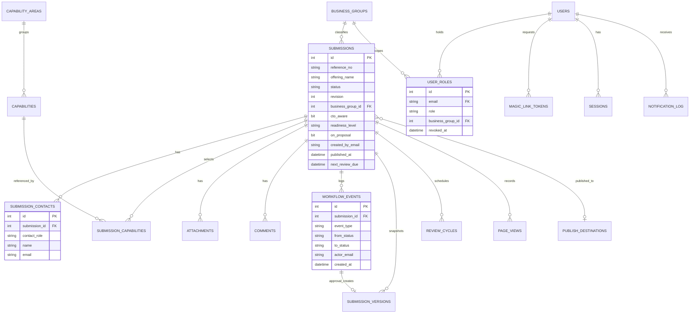

# 03 – Data Model

This document maps the existing intake form to a relational schema in Azure Database for PostgreSQL, defines the
supporting entities for workflow, RBAC, audit, and metrics, and describes attachment storage and
retention.

---

## 1. Intake form field inventory

Source: *Solution / Offering Executive Summary – Business Offering Intake* (Microsoft Form). Every field is
reproduced; one new field (Offering Name) is added because the current form has no title for the offering.

### Section 1 – Overview

| # | Form field | Required | Type in app | Column / table | Notes |
|---|---|---|---|---|---|
| new | **Offering Name** | Yes | Text (≤150) | `submissions.offering_name` | **Added.** Needed for lists, emails, export, and the published page. |
| 1 | Recorder Name | Yes | Text (≤150) | `submission_contacts` row with `contact_role = recorder`; `submissions.created_by_email` | Email is captured automatically from the signed-in user; the name is entered. |
| 1 | Business Group | Yes | Dropdown | `submissions.business_group_id` → `business_groups` | List to be supplied by the business. Admin-maintained. |
| 1 | Is the CTO for your business group aware that you are submitting this request? | Yes | Yes / No | `submissions.cto_aware` (bit) | |
| 2 | Customer Challenge | Yes | Long text | `submissions.customer_challenge` | |
| 3 | Description of Technical Solution | Yes | Long text | `submissions.technical_description` | |
| 4 | Offering Owner(s) incl. contact info | Yes | Repeating contact rows | `submission_contacts` rows with `contact_role` in (`owner_technical`, `owner_operations`) | Structured as name + email + optional phone per contact so that owners can be notified and granted edit rights. Categories align to the RACI: **Owner - Technical** and **Owner - Operations**. At least one owner required. |

### Section 2 – Offering Classification (select at most 3 across all areas)

| # | Capability area | Required | Type in app | Column / table |
|---|---|---|---|---|
| 5 | Mission Modernization & Sustainment | Group | Checkboxes | `submission_capabilities` → `capabilities` |
| 6 | Space Systems | Group | Checkboxes | same |
| 7 | Digital Transformation | Group | Checkboxes | same |
| 8 | Sustainability & Environment | Group | Checkboxes | same |
| 9 | Advanced Energy Solutions | Group | Checkboxes | same |
| 10 | Data Analytics and Cyber Solutions | Group | Checkboxes | same |
| 11 | Other (please specify) | Group | Checkbox + free text | same; `submission_capabilities.other_text` when `capabilities.code = 'other'` |

The form marks each area as required, but the instruction is "select at most 3 (your top 1–3 offerings)".
The app enforces **minimum 1 and maximum 3 selections in total** across all areas. "Other" is its own
area (11) rather than an item under Data Analytics and Cyber Solutions. The full taxonomy is in section 4
below.

### Section 3 – Market & Opportunity Analysis

| # | Form field | Required | Type in app | Column | Notes |
|---|---|---|---|---|---|
| 12 | Key Differentiators | Yes | Long text (2–5 bullets, ≤200 words) | `submissions.key_differentiators` | "Provide 2-5 bullet points summarizing how your solution is differentiated; what is unique, best, first, or only about it?" |
| 13 | Level of Readiness Achieved | Yes | Single choice | `submissions.readiness_level` | Values: `conceptual` (Conceptual / White Paper), `prototype`, `test_phase` (Pilot / Test Phase), `single_deployment`, `multi_client_deployment` |
| 13 | Relevant programs or clients (conceptualised or deployed) | No | Long text | `submissions.readiness_programs` | Sub-question of 13. |
| 14 | Is this solution currently bid on a proposal? | Yes | Yes / No | `submissions.on_proposal` (bit) | Replaces the former "Currently Deployed or Proposed" dropdown. The follow-up "for which program or customer" box was removed as redundant with the readiness and pipeline fields. |
| 15 | Current Pipeline (opportunities and contract value) | No | Long text | `submissions.current_pipeline` | Sits above Additional Customers; neither is required. |
| 16 | Additional Customers | No | Long text | `submissions.additional_customers` | |

### Section 4 – Supporting Resources

| # | Form field | Required | Type in app | Column / table | Notes |
|---|---|---|---|---|---|
| 17 | Supporting Resource Files (up to 10) | No | File upload | `attachments` rows; binary in Blob Storage | Optional. Max 10 per submission, 25 MB per file; PDF, Office, images, ZIP. A sensitive-data warning sits directly above the file picker. |
| 18 | Supporting Resource Links or Notes | No | Long text | `submissions.resource_links_notes` | Optional. |
| 19 | Relevant Partnerships | No | Long text | `submissions.relevant_partnerships` | Partners, teammates, OEMs, universities or vendors involved in the solution. |
| 20 | Partner website | No | URL (≤1000) | `submissions.partnership_url` | Link to the partner's website. |

### Confirmation (all sections)

| # | Form field | Required | Type in app | Column | Notes |
|---|---|---|---|---|---|
| 21 | No sensitive data confirmation | Yes | Checkbox | `submissions.sensitive_data_ack_at`, `sensitive_data_ack_by_email`, `sensitive_data_ack_ip` | The submitter must confirm that nothing in the form or its attachments is ITAR / EAR, CUI, FCI, classified, customer-proprietary or personal. Ticking it writes a `sensitive_data_ack` workflow event so the consent can be produced later; clearing it withdraws the confirmation and blocks submission. Disclaimer text lives in `app/content.py` pending final wording from Corporate Security. |

**Word limits.** Customer Challenge and Description of Technical Solution are capped at 300 words each and
Key Differentiators at 200. Counters run live in the browser and the limits are re-checked server side in
`app/content.py`.

---

## 2. Entities

| Table | Purpose | Key columns |
|---|---|---|
| `submissions` | One row per Solution / Offering record | `id`, `reference_no` (SOL-YYYY-NNNN), `offering_name`, `status`, `revision`, `business_group_id`, `cto_aware`, `customer_challenge`, `technical_description`, `key_differentiators`, `readiness_level`, `readiness_programs`, `on_proposal`, `current_pipeline`, `additional_customers`, `resource_links_notes`, `relevant_partnerships`, `partnership_url`, `sensitive_data_ack_at`, `sensitive_data_ack_by_email`, `sensitive_data_ack_ip`, `created_by_email`, `assigned_reviewer_email`, `approved_version_id`, `publish_destination_id`, `published_url`, `submitted_at`, `review_completed_at`, `published_at`, `next_review_due`, `created_at`, `updated_at`, `archived_at` |
| `submission_contacts` | Recorder and the technical / operations owners | `submission_id`, `contact_role`, `name`, `email`, `phone`, `is_primary` |
| `business_groups` | Dropdown reference data | `id`, `name`, `is_active`, `sort_order` |
| `capability_areas` | The six classification areas plus "Other" | `id`, `name`, `sort_order` |
| `capabilities` | Items within each area (incl. `other`) | `id`, `area_id`, `code`, `name`, `is_active`, `sort_order` |
| `submission_capabilities` | Selected capabilities (1–3) | `submission_id`, `capability_id`, `other_text` |
| `attachments` | Metadata for uploaded files | `id`, `submission_id`, `blob_path`, `original_filename`, `content_type`, `size_bytes`, `sha256`, `uploaded_by_email`, `uploaded_at`, `deleted_at` |
| `comments` | Threaded discussion per submission | `id`, `submission_id`, `author_email`, `body`, `is_blocking`, `resolved_at`, `created_at` |
| `workflow_events` | Append-only audit and approval record | `id`, `submission_id`, `revision`, `event_type`, `from_status`, `to_status`, `actor_email`, `actor_name`, `note`, `ip`, `user_agent`, `created_at` |
| `submission_versions` | Immutable JSON snapshot at each approval | `id`, `submission_id`, `revision`, `snapshot_json`, `approval_event_id`, `created_at` |
| `publish_destinations` | Admin-maintained list of publishing targets | `id`, `name`, `base_url`, `is_active` |
| `review_cycles` | Six-month content review tracking | `id`, `submission_id`, `due_at`, `notified_at`, `confirmed_at`, `confirmed_by_email`, `closed_reason` |
| `users` | Anyone who has signed in | `email` (PK, lowercased), `display_name`, `domain`, `first_seen_at`, `last_sign_in_at`, `is_disabled` |
| `user_roles` | RBAC assignments | `id`, `email`, `role` (`reviewer`, `approver`, `publisher`, `admin`), `business_group_id` (nullable = all), `granted_by_email`, `granted_at`, `revoked_at` |
| `magic_link_tokens` | Pending sign-in tokens | `token_hash` (PK), `email`, `redirect_path`, `expires_at`, `used_at`, `request_ip`, `created_at` |
| `sessions` | Server-side session registry (for revocation) | `id`, `email`, `created_at`, `last_seen_at`, `expires_at`, `revoked_at`, `ip`, `user_agent` |
| `notification_log` | Every email queued and its delivery result | `id`, `submission_id` (nullable), `to_email`, `template`, `subject`, `queued_at`, `sent_at`, `status`, `provider_message_id`, `error` |
| `page_views` | Usage metric per submission | `id`, `submission_id`, `viewer_email`, `viewed_at`, `kind` (`view`, `download`) |
| `app_settings` | Reserved for admin-editable configuration (MVP reads configuration from App Service settings) | `key`, `value`, `updated_by_email`, `updated_at` |
| `rate_limit_counters` | Hourly counters for sign-in and verify attempts per email / IP | `scope`, `key`, `window_start`, `count` |
| `reference_sequences` | Per-year counter behind `SOL-YYYY-NNNN` reference numbers | `year`, `last_value` |

---

## 3. Entity relationship diagram

---

## 4. Capability taxonomy seed data

Seeded from the capability areas published on amentum.com. Admins can rename, deactivate, or add items;
deactivated items remain valid on historical records.

| Area | Capability |
|---|---|
| Mission Modernization & Sustainment | Research Development, Test and Evaluation |
|  | C5ISR Systems Engineering & Sustainment |
|  | UAS Engineering & Sustainment |
|  | Aviation Engineering & Sustainment |
|  | Land Vehicles & Equipment Sustainment |
|  | Naval Engineering & Sustainment |
|  | Naval Deterrent Sustainment |
|  | Advanced Test, Training, & Aerial Systems |
|  | Global Logistics & Supply Chain Management |
|  | Intelligence Infrastructure Solutions |
|  | Nuclear Security and Deterrence |
|  | Medical and Disaster Response |
| Space Systems | Ground Systems |
|  | Spaceports |
|  | Spaceflight Hardware |
|  | Orbit Operations |
|  | Exploration Science |
|  | Satellite Payloads |
| Digital Transformation | Software Development & Engineering |
|  | Information Analytics |
|  | Critical Infrastructure and Advanced Networks |
|  | Cybersecurity |
|  | Digital Engineering |
|  | Cloud |
|  | Agile Delivery Process |
| Sustainability & Environment | Environmental Remediation & Decommissioning |
|  | Site Assessment & Characterization |
|  | Environmental Consulting |
|  | Environmental Risk Assessment |
|  | Environmental Regulatory Compliance, Permitting and Licensing |
|  | Eradication of Emerging Contaminants (PFAS) |
|  | Environmental Site Restoration and Reuse |
|  | Radioactive Waste Management and Radiation Protection |
| Advanced Energy Solutions | Renewable Energy Solutions |
|  | Energy Consulting |
|  | Nuclear Engineering & Design |
|  | Commissioning, Operational Support and Life Extension |
|  | Regulatory, Site Licensing and Permitting |
|  | Research, Laboratory and Energy Test Bed Operations |
| Data Analytics and Cyber Solutions | All-Source Intelligence Collection & Analytics |
|  | Counter Intelligence Solutions |
|  | Continuous Cyber Monitoring & Threat Analytics |
|  | Offensive / Defensive Cyber Operations |
|  | Full-spectrum Cyber Training |
|  | Advanced Communication Solutions |
|  | Managed Bandwidth & Secure Network Solutions |
|  | Integrated Biometrics |
|  | Business Process Analytics |
| Other | Other (please specify) |

Total: 7 areas (six capability areas plus "Other"), 49 capabilities, taken from the
capability pages on amentum.com. Validation rule: 1 ≤ selected ≤ 3 across all areas; `other_text` is
required when "Other" is selected. Capabilities dropped from the taxonomy are deactivated rather than
deleted so that historical records keep their classification.

---

## 5. Enumerations

| Enum | Values |
|---|---|
| `status` | `draft` (optional), `submitted`, `under_review`, `updates_required`, `awaiting_approval`, `approved`, `ready_to_publish`, `published`, `rejected`, `withdrawn` |
| displayed stage | `submitted`, `under_review`, `awaiting_edits`, `approved`, `published` — the five stages shown to users; `awaiting_approval` displays as Under Review and `ready_to_publish` as Approved |
| `contact_role` | `recorder`, `owner_technical`, `owner_operations` (rows written before September 2026 used `owner`, `co_lead`, `solution_architect`; the migration converts them) |
| `readiness_level` | `conceptual`, `prototype`, `test_phase`, `single_deployment`, `multi_client_deployment` |
| `role` | `reviewer`, `approver`, `publisher`, `admin` |
| `event_type` | `transition`, `comment`, `attachment_added`, `attachment_removed`, `contact_changed`, `fields_edited`, `role_granted`, `role_revoked`, `sign_in`, `review_confirmed`, `export_downloaded`, `reminder_sent`, `sensitive_data_ack` |

---

## 6. Attachment storage (Blob)

- One storage account, one private container `attachments`. No anonymous access; the app authenticates with
  the account key held in App Service settings.
- Blob path: `submissions/{submission_id}/{attachment_id}/{sanitised_original_filename}`.
- Uploads are streamed through the app (validates size, count, and content type, computes SHA-256) and
  written with the storage account key. Direct-to-blob SAS uploads are a possible later optimisation.
- Downloads are streamed through the app after it checks the user's permission on the parent submission, and
  logged to `page_views` with `kind = download`.
- Soft delete (30 days) and blob versioning enabled. Removing an attachment in the app sets
  `attachments.deleted_at` and deletes the blob (recoverable via soft delete).
- Lifecycle policy: blobs for archived submissions move to Cool tier after 90 days.

---

## 7. Retention, backup, and integrity

| Item | Policy |
|---|---|
| PostgreSQL Flexible Server | 7-day point-in-time restore included (configurable to 35 days). Long-term retention can be enabled if the business requires it. |
| Blob | Soft delete 30 days, versioning on, no lifecycle deletion of active records. |
| Withdrawn / Rejected records | Retained and visible to Admins; proposed default: archive after 24 months, then delete attachments (open question 8 in doc 01). |
| Audit log | Never deleted while the submission exists; exported with the submission on archive. |
| Magic-link tokens | Deleted 24 hours after expiry by the scheduler. |
| Sessions | Rows expire with the cookie; revoked and expired rows purged after 30 days. |
| Notification log | Retained 12 months. |
| Page views | Retained indefinitely (small), aggregated for metrics. |

Reference numbers are generated from a per-year counter row locked `FOR UPDATE` inside the submit transaction so
they are unique and gap-free within a year. The schema is managed with Alembic migrations (`alembic/versions/`).
