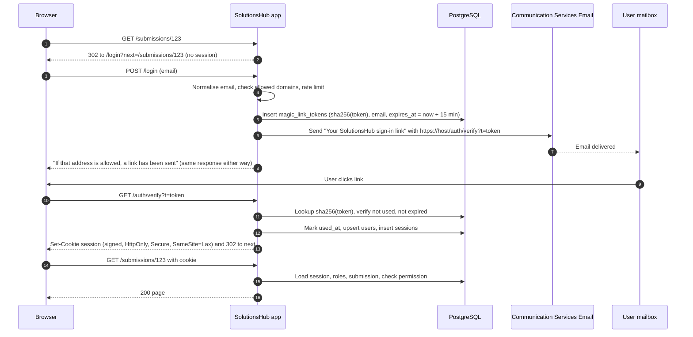

# 04 – Authentication and Access Control

This document describes how SolutionsHub establishes who a user is and what they are allowed to do, given
that Entra ID / corporate SSO is unavailable across the two unconnected domains and the application is
reachable from the public internet by decision.

---

## 1. Layered model

| Layer | Question answered | Mechanism |
|---|---|---|
| 1. Network edge | (none by decision) Anyone can reach the sign-in page | Public HTTPS endpoint; every other route requires a session |
| 2. Transport | Is the connection protected? | HTTPS only, TLS 1.2 minimum, HSTS |
| 3. Identity | Which work mailbox does this person control? | Magic-link email sign-in on an allowed-domain address |
| 4. Session | Is this browser still the same signed-in person? | Signed, HttpOnly, Secure cookie backed by a server-side session row |
| 5. Authorization | May this person perform this action on this record? | App-managed roles plus per-record ownership, enforced server-side |
| 6. Audit | What happened and who did it? | Append-only `workflow_events` including sign-ins, role changes, approvals |

With no network layer, identity carries the load: nobody can do anything beyond requesting a sign-in link
without controlling a mailbox on an allowed Amentum domain. The sign-in page is therefore hardened as a
public surface (uniform responses, rate limits, single-use short-lived tokens).

---

## 2. Network edge: public endpoint

The sponsor decided that anyone may reach the endpoint but only Amentum mailboxes may sign in, so there is no
IP allowlist. What is exposed anonymously:

| Route | Purpose | Protection |
|---|---|---|
| `GET /login`, `POST /login` | Request a sign-in link | CSRF token, per-email (5/hour) and per-IP (30/hour) limits, identical response whether or not the address is allowed |
| `GET /auth/verify` | Consume a sign-in link | Token is single-use, hashed at rest, 15-minute lifetime; failed attempts limited per IP (10/hour) |
| `GET /health` | Platform health probe | Returns only `ok`/`degraded` |
| `/static/*` | CSS, JS, logo | Static files |

Everything else returns a redirect to sign-in without a valid session. HTTPS is enforced, TLS 1.2 minimum,
HSTS and a strict Content Security Policy are set on every response, and FTP is disabled.

If probing or spam becomes a nuisance, Azure Front Door with WAF (or re-enabling App Service IP access
restrictions for a known set of ranges) can be added without application changes.

## 3. Identity: magic-link email sign-in

### 3.1 Why magic link

- Proves control of a work mailbox on an allowed domain, which is the only identity anchor both domains
  share.
- Zero provisioning: any employee with an Amentum mailbox can submit immediately; their email is captured as the
  submitter identity and used for updates, satisfying the "simple for anyone, but tracked" requirement.
- No passwords to store, rotate, reset, or leak.
- Every notification email already carries a link into the app, so the sign-in experience and the
  workflow experience are the same gesture.

### 3.2 Sequence

### 3.3 Token and link policy

| Property | Value |
|---|---|
| Token | 32 random bytes from the OS CSPRNG, URL-safe base64 in the link; only the SHA-256 hash is stored |
| Lifetime | 15 minutes |
| Use | Single use; consumed atomically on first valid verify |
| Binding | Bound to the requested email; not bound to the requesting IP (users may open the link on another device or network) |
| Redirect | `next` path is validated to be a relative path on this host |
| Outstanding tokens | Requesting a new link invalidates earlier unused tokens for that email |
| Cleanup | Expired tokens purged 24 hours after expiry |

### 3.4 Allowed email domains

- Configured as the `ALLOWED_EMAIL_DOMAINS` application setting (Bicep parameter `allowedEmailDomains`):
  `amentum.com`, `global.amentum.com`, `amentumcms.com`.
- Matching is exact on the domain part after lowercasing; sub-domains must be listed explicitly.
- The login response is identical whether or not the address is allowed, to avoid enumerating valid
  domains or addresses. Rejected attempts are logged.

### 3.5 Deliverability

Sign-in depends on email arriving promptly. Phase 1 must:

- Verify a **custom sender domain** in Communication Services (SPF, DKIM, DMARC) rather than relying on
  the Azure-managed `*.azurecomm.net` domain for production.
- Ask mail administrators on both domains to allowlist the sender.
- Provide an Admin "resend sign-in link" action and expose delivery status from `notification_log`.

---

## 4. Sessions

| Property | Value |
|---|---|
| Cookie | `__Host-sh_session`; `Secure`, `HttpOnly`, `SameSite=Lax`, `Path=/`; value is a random session id signed with the `SECRET_KEY` application setting |
| Server-side record | `sessions` row with email, created, last seen, expiry, IP, user agent. Allows revocation and "sign out everywhere". |
| Lifetime | 8 hours sliding (extends on activity, up to 24 hours absolute) by default; "Remember me" extends to 30 days absolute |
| Revocation | User sign-out; Admin "disable user" revokes all sessions; role changes take effect on next request (roles are loaded per request, not cached in the cookie) |
| Key rotation | Change the `SECRET_KEY` setting (App Service restarts); all users sign in again via email. Dual-key rotation can be added later. |
| CSRF | Synchroniser token on every state-changing form; HTMX requests carry the token in a header; SameSite=Lax as a second layer |

---

## 5. Authorization

### 5.1 Model

Authorization is a function of three inputs evaluated on the server for every request:

1. **Role assignments** for the signed-in email from `user_roles` (active rows only), including any
   business-group scope.
2. **Record relationship**: whether the email appears in `submission_contacts` for the target record as
   recorder, owner, co-lead, or solution architect.
3. **Record state**: whether the requested action is valid from the current status (see the transition
   table in doc 02).

The permission matrix in doc 02 is implemented as a single policy module with one function per action,
unit-tested against every role and state combination. Route handlers call the policy and never
re-implement checks inline.

### 5.2 Separation of duties

- A user cannot approve, reject, or mark review complete on a submission where they are a contact.
- A user cannot grant themselves a role; role changes require an existing Admin, and the audit row records
  both parties.
- The bootstrap Admin is set by an app setting (`BOOTSTRAP_ADMIN_EMAIL`) and is only honoured while
  `user_roles` contains no admin rows.

### 5.3 Role administration UI (Admin only)

- Search users by email; grant or revoke Reviewer, Approver, Publisher, Admin; optionally pick one or more
  business groups as scope.
- Disable a user (blocks sign-in and revokes sessions) without deleting history.
- View role history (who granted what, when).
- Maintain allowed email domains, Business Groups, capability taxonomy, publish destinations, reminder
  thresholds, and attachment limits.

---

## 6. Rate limiting and abuse controls

| Control | Setting (configurable) |
|---|---|
| Sign-in link requests | Max 5 per email per hour; max 30 per source IP per hour; exponential back-off responses |
| Verify attempts | Max 10 failed verifies per IP per hour, then temporary block |
| Attachment uploads | Max 10 files per submission; default 25 MB per file; allowed types by extension and sniffed MIME; filenames sanitised; stored under a generated path |
| Form submissions | Max 20 new submissions per email per day (prevents accidental scripts) |
| Comments | Max 60 per user per hour |
| Request size | Body limit enforced at the ASGI server; multipart streamed to Blob, never fully buffered in memory |

Rate-limit counters live in the database (small volume) so no extra cache service is required.

---

## 7. Application and platform hardening

- Service credentials (PostgreSQL password, storage account key, Communication Services connection string)
  are generated or read by the Bicep template and written to App Service application settings, which are
  encrypted at rest and visible only to identities with write access to the web app. They never appear in
  source control or CI logs. Key Vault + managed identity is the upgrade path once the team can create role
  assignments.
- Security headers: `Content-Security-Policy` (self only, nonce for the HTMX script), `X-Content-Type-Options`,
  `Referrer-Policy`, `Permissions-Policy`, HSTS.
- Dependency scanning (pip-audit or Dependabot) in CI; pinned Python runtime on App Service.
- Diagnostic logs and Application Insights with PII scrubbing of email addresses in traces (email is kept
  in the audit table, not in telemetry).
- Storage account: shared-key access enabled (the app authenticates with the account key), no public blob
  access, minimum TLS 1.2, soft delete and versioning on.
- PostgreSQL Flexible Server: TLS required, password authentication (password generated by the template and
  held in the `DATABASE_URL` setting), firewall rule limited to Azure services. Hardening step: restrict to
  the web app's outbound IPs or VNet integration.

---

## 8. Threat notes

| Threat | Mitigation |
|---|---|
| Anyone on the internet reaches the app | Only the sign-in page is anonymous; it discloses nothing, is rate limited, and issues links only to allowed domains. |
| VPN user tries to sign in as a colleague | They would need to read the colleague's mailbox; token is single-use, 15 minutes, hashed at rest. |
| Forwarded sign-in email | Link works only once and expires quickly; every sign-in is logged with IP and user agent; suspicious sign-ins are visible to Admins. |
| Session cookie theft via XSS | HttpOnly cookie; strict CSP; templates auto-escape; HTMX responses are server-rendered. |
| CSRF on approve/publish actions | Per-form synchroniser token plus SameSite=Lax. |
| Privilege escalation via UI tampering | All checks server-side in one policy module; UI is advisory only. |
| Approver approving their own offering | Explicit separation-of-duties rule. |
| Malicious attachment | Type and size limits, MIME sniffing, never executed or rendered inline server-side; downloads served with `Content-Disposition: attachment`; optional Defender for Storage malware scanning if Cyber requires it (adds cost). |
| Email enumeration | Uniform login response; rate limits. |
| Lost or rotated signing key | All users re-sign-in via email; no data is lost. |
| Data loss | SQL point-in-time restore (7 days), Blob soft delete and versioning, immutable approval snapshots. |

---

## 9. What Cyber review will likely ask, and where the answer is

| Question | Reference |
|---|---|
| How is access restricted to Amentum users? | Section 3 (identity) – the endpoint itself is public, section 2 |
| How are approvers authenticated and authorised? | Sections 3, 5 |
| Where is data stored and how is it encrypted? | Doc 01 section 7; this doc section 7 |
| Is there an audit trail of approvals? | Doc 02 section 6 |
| How are secrets handled? | Section 7 |
| What is the backup and recovery posture? | Doc 03 section 7 |
| What third parties are involved? | None beyond Azure and GitHub (source control, CI/CD, container registry) |
| What are the residual risks? | Doc 01 section 9.4; this doc section 8 |
