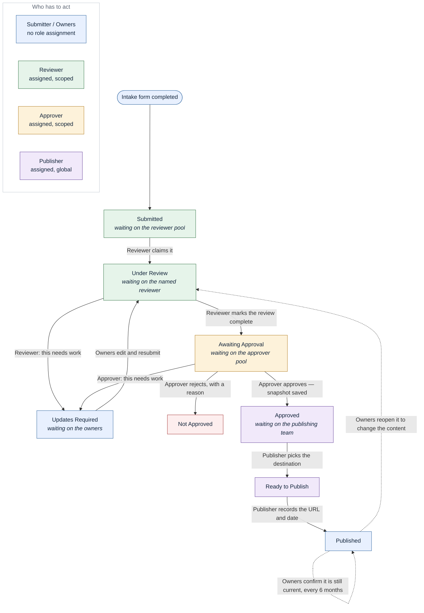

# 06 – Approval Flow at a Glance

A one-page view of the approval process, written to answer one question: **who needs to be given
which role, and how many of them do we need?**

The detail behind this page — the full permission matrix, guards, notifications and audit record —
is in [02 – Workflow & RBAC](02-workflow-and-rbac.md). This page is the summary for the business
conversation; nothing here changes the behaviour already built in `app/workflow.py` and `app/policy.py`.

---

## 1. The flow

One record's journey from intake to published. Solid arrows move it forward, dotted arrows are the
ways it comes back around after publication.

Each box is a status in the system; its colour is **who the record is waiting on** while it sits there.
An Admin can perform any of these transitions as a safety valve, assigns every other role, maintains the
Business Group and capability lists, and can archive or reopen records — Admin is not a stage in the flow,
which is why it has no box of its own.

---

## 2. Who does what, and what has to be true

| Step | Who can do it | The system will not let them unless |
|---|---|---|
| Submit | Any signed-in user on an allowed email domain | All required fields are filled, 1–3 capabilities chosen, at least one Offering Owner named, and at least one file or resource link attached |
| Claim for review | **Reviewer** in scope for that Business Group | The record is *Submitted* |
| Request updates | **Reviewer** (during review) or **Approver** (at approval) | They have written what needs to change |
| Resubmit | The recorder, owners or co-leads | The record passes the same completeness check as first submission |
| Mark review complete | **Reviewer** in scope | The record is complete and no blocking comment is unresolved. A reviewer **cannot** do this on a record they are named on |
| Approve / Reject | **Approver** in scope | They are **not** the recorder, owner or co-lead of that record — this applies to Admins too. Rejection needs a written reason |
| Confirm ready to publish | **Publisher** | A publishing destination has been selected |
| Record publication | **Publisher** | The published URL has been entered |
| Confirm still current | Owners and co-leads | The record is *Published* |

The two separation-of-duties rules are enforced in code (`app/policy.py`), not just by convention:

1. Nobody completes the review on their own offering.
2. Nobody approves their own offering — **including Site Admins**.

The practical consequence: if the same small group both submits offerings and approves them, you need
at least two people who can approve within each Business Group, or approvals will deadlock whenever
one of them is an owner.

---

## 3. How many people do we need?

| Role | Minimum | Comfortable | Why |
|---|---|---|---|
| Reviewer | 1 per Business Group | 2 per Business Group | Cover for leave; reviewers cannot review their own offerings |
| Approver | 2 per Business Group | 2–3 per Business Group | Approvers are frequently also offering owners, and they are locked out of their own records |
| Publisher | 1 | 2 | One pool for the whole site; this is the marketing / comms handoff |
| Admin | 2 | 2 | Role administration and the break-glass path; keep it small |

A reviewer or approver with **no** Business Group scope set sees everything. That is the simplest
starting configuration if the business wants a single central pool — scoping can be added later
without a code change.

---

## 4. Worksheet — fill this in to go live

Business Groups are placeholders until the business confirms them (`app/seed.py`, editable in Admin).

| Business Group | Reviewer(s) | Approver(s) |
|---|---|---|
| Digital Solutions | | |
| Global Engineering Solutions | | |
| Corporate / Enterprise Functions | | |
| *(unscoped — sees everything)* | | |

| Site-wide role | People |
|---|---|
| Publisher | |
| Admin | |

Everything else needs no assignment: anyone who can sign in can submit, and owners get their rights
from being named on the record.
